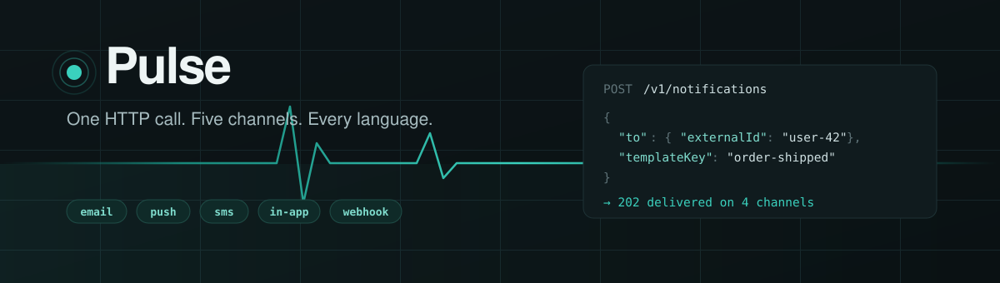
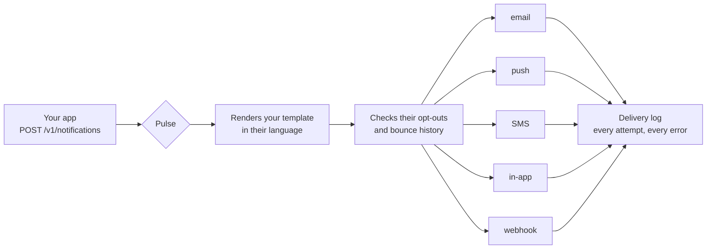
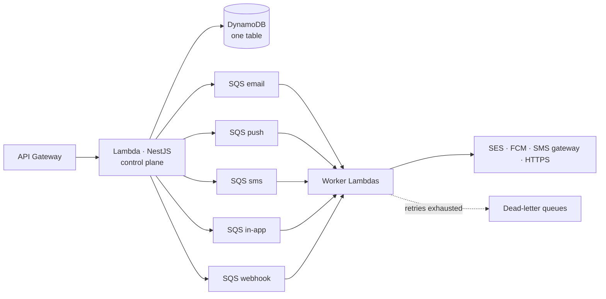

<div align="center">



<br>

**Stop rebuilding notifications in every project.**

Pulse takes one HTTP call and delivers it over email, push, SMS, an in-app inbox
and webhooks — in the recipient's language, respecting their opt-outs, retrying
what fails, logging every attempt.

<br>


<br>

**[Get running](#1--get-it-running) · [Send one](#2--send-your-first-notification) · [Use it in your app](#3--use-it-in-your-app) · [Reference](#reference)**

</div>

<br>

> **You host it. You own it.**
> No signup, no account, no API key to get from anyone. You deploy Pulse and mint
> your own keys.

---

## What actually happens



Your app never decides *how* to notify someone. It says **what happened**; Pulse
decides the rest.

---

# 1 · Get it running

**Needs:** Node 24+, pnpm 11+, Docker.

```bash
git clone https://github.com/arafatomer66/pulse.git && cd pulse

pnpm install
docker compose up -d     # local stand-ins for the AWS bits
cp .env.example .env
pnpm build
pnpm seed                # a demo account, a user, two templates
pnpm dev                 # the API + the delivery workers
```

Open **<http://localhost:3100/console>**. It signs itself in.

> [!IMPORTANT]
> `pnpm dev` starts **two** processes — the API that *accepts* messages, and the
> workers that *deliver* them. If a message sits at `queued` forever, the workers
> aren't running.

---

# 2 · Send your first notification

In the console, on the **Send** tab:

| | |
|---|---|
| **1** | Leave *Recipient by* on `Subscriber ID` |
| **2** | Paste `sub_demo000000000000000000` |
| **3** | Pick the `order-shipped` template |
| **4** | Press **Send** |

Two seconds later you get a result per channel:

```
status: delivered

  email    delivered   <4c0307ad-c986-…@pulse.local>
  inapp    delivered   01KZ1N0JNBE54JYSE324FF121K
  push     delivered   log-1785688246951
  sms      delivered   log-1785688246956
```

Open **<http://localhost:8125>** to read the email that actually left.

That's a real multi-channel notification, sent. Now make your app do it.

---

# 3 · Use it in your app

### Step 1 — tell Pulse who your users are

Once per user. Use **your own** user ID as `externalId`, so you never store a
Pulse ID anywhere.

```bash
curl -X POST $PULSE/v1/subscribers -H "Authorization: Bearer $KEY" -d '{
  "externalId": "sd-user-8821",
  "email": "omer@example.com",
  "phone": "01712345678",
  "locale": "bn"
}'
```

*(`01712345678` becomes `+8801712345678` automatically.)*

### Step 2 — write what to say, once, for every channel

```bash
curl -X POST $PULSE/v1/templates -H "Authorization: Bearer $KEY" -d '{
  "key": "order-shipped",
  "name": "Order shipped",
  "locales": {
    "en": {
      "email": { "subject": "Order {{ order.id }} is on its way",
                 "html": "<p>Hi {{ subscriber.name }}, arriving {{ order.eta }}.</p>" },
      "push":  { "title": "On its way", "body": "Order {{ order.id }}" },
      "sms":   { "text": "Order {{ order.id }} shipped." },
      "inapp": { "title": "Shipped", "body": "Order {{ order.id }}",
                 "deeplink": "/orders/{{ order.id }}" }
    },
    "bn": {
      "email": { "subject": "অর্ডার {{ order.id }} পাঠানো হয়েছে", "html": "<p>পথে আছে।</p>" },
      "push":  { "title": "পাঠানো হয়েছে", "body": "অর্ডার {{ order.id }}" }
    }
  }
}'
```

Or paste it into the console's **Templates** tab.

### Step 3 — send, from your code

```ts
await fetch(`${PULSE_URL}/v1/notifications`, {
  method: 'POST',
  headers: {
    authorization: `Bearer ${PULSE_KEY}`,
    'content-type': 'application/json',
    'idempotency-key': `order-${order.id}-shipped`,   // retry-safe
  },
  body: JSON.stringify({
    to: { externalId: user.id },
    templateKey: 'order-shipped',
    data: { order },
  }),
});
```

**That's the whole integration.** No channel logic, no language check, no
unsubscribe check, no retry loop — all of it lives in Pulse.

<details>
<summary><b>The same thing as a reusable NestJS service</b></summary>

<br>

```ts
@Injectable()
export class PulseService {
  private readonly base = process.env.PULSE_URL!;
  private readonly key = process.env.PULSE_API_KEY!;

  async notify(input: {
    userId: string;
    templateKey: string;
    data?: Record<string, unknown>;
    channels?: string[];
    idempotencyKey?: string;
  }) {
    const res = await fetch(`${this.base}/v1/notifications`, {
      method: 'POST',
      headers: {
        authorization: `Bearer ${this.key}`,
        'content-type': 'application/json',
        ...(input.idempotencyKey ? { 'idempotency-key': input.idempotencyKey } : {}),
      },
      body: JSON.stringify({
        to: { externalId: input.userId },
        templateKey: input.templateKey,
        channels: input.channels,
        data: input.data ?? {},
      }),
    });
    if (!res.ok) throw new Error(`pulse ${res.status}: ${await res.text()}`);
    return res.json();
  }
}
```

Every call site is then one line:

```ts
await this.pulse.notify({
  userId: buyer.id,
  templateKey: 'order-shipped',
  data: { order },
  idempotencyKey: `order-${order.id}-shipped`,
});
```

</details>

<details>
<summary><b>Flutter — push registration and the notification bell</b></summary>

<br>

```dart
// On login — so push can reach them
await dio.post('/v1/subscribers/$subscriberId/devices', data: {
  'token': await FirebaseMessaging.instance.getToken(),
  'platform': Platform.isIOS ? 'ios' : 'android',
});

// The bell
final res = await dio.get('/v1/inbox',
    queryParameters: {'subscriberId': subscriberId});

res.data['unreadCount'];   // badge
res.data['data'];          // title, body, deeplink, readAt — newest first

await dio.post('/v1/inbox/$itemId/read',
    queryParameters: {'subscriberId': subscriberId});
```

</details>

---

# Reference

## Common sends

<table>
<tr><td width="50%">

**An OTP — SMS only**<br>
Never let a passcode fan out to email.

```json
{ "to": { "externalId": "sd-user-8821" },
  "templateKey": "otp",
  "channels": ["sms"],
  "data": { "code": "4821" } }
```

</td><td width="50%">

**Scheduled, and cancellable**

```json
{ "to": { "externalId": "sd-user-8821" },
  "templateKey": "cart-reminder",
  "sendAt": "2026-08-03T09:00:00Z" }
```

`POST /v1/notifications/{id}/cancel`

</td></tr>
<tr><td>

**Everyone on a topic**

```json
POST /v1/topics/dhaka-buyers/broadcast

{ "templateKey": "new-feature",
  "channels": ["inapp", "push"] }
```

</td><td>

**One-off, no template, no subscriber**

```json
{ "to": { "email": "a@example.com" },
  "channels": ["email"],
  "content": { "email": {
    "subject": "Your invoice",
    "html": "<p>Attached.</p>" } } }
```

</td></tr>
</table>

> [!TIP]
> Always send an `Idempotency-Key` from your own domain — `order-1001-shipped`.
> Retry the same call and Pulse returns the original result and **sends nothing**.

## The five channels

| Channel | Needs | Delivered by |
|---|---|---|
| `email` | An email address | AWS SES, **or any SMTP server** |
| `push` | A registered device token | Firebase — Android, iOS and web |
| `sms` | A phone number | BulkSMS BD, or AWS SNS |
| `inapp` | Nothing but the subscriber | Pulse itself; your app reads the feed |
| `webhook` | A registered endpoint | A signed HTTPS POST to you |

**You rarely name channels.** Omit `channels` and Pulse uses every one the
template defines and the person can actually receive on.

## What the results mean

<table>
<tr><td width="50%">

**Per channel**

| | |
|---|---|
| `delivered` | The provider accepted it |
| `suppressed` | Opted out, or previously bounced. **Deliberate** |
| `skipped` | Nothing to send on — no phone, no device, no body |
| `failed` | Rejected after retries — read `error` |

</td><td width="50%">

**The whole message**

| | |
|---|---|
| `queued` | Accepted, heading to the workers |
| `scheduled` | Waiting. Still cancellable |
| `delivered` | Nothing failed |
| `partial` | Some landed, some failed |
| `failed` | Everything failed |

</td></tr>
</table>

> [!NOTE]
> A message where every channel was `suppressed` reports **`delivered`**. Pulse
> did exactly what the person's preferences asked — that's success, not failure.

## Opt-outs and bounces

```bash
POST /v1/subscribers/{id}/unsubscribe     { "channel": "email" }
PUT  /v1/subscribers/{id}/preferences     { "categories": { "marketing": false } }
```

Every future send respects it. You add no checks anywhere in your code.

When an address permanently bounces or someone marks a message as spam, it goes
on a suppression list automatically and is never mailed again.

> [!WARNING]
> This isn't optional. AWS measures your bounce and complaint rates — cross ~5%
> bounces or ~0.1% complaints and they throttle or suspend your ability to send
> email **at all**.

<details>
<summary><b>Templates — the three rules</b></summary>

<br>

Text is [Liquid](https://liquidjs.com); `{{ order.id }}` pulls from the `data`
you send. It's sandboxed, so templates can't execute code.

- **English is the fallback.** `locales.en` is required. If Bengali defines no
  `sms`, a Bengali user still gets the English SMS rather than silence.
- **A missing channel is skipped, not an error.** Ask for `webhook` on a template
  that has none and it returns `skipped` while everything else delivers.
- **Editing publishes a new version.** Old versions stay readable, and a message
  already accepted keeps the wording it was accepted with — an edit can never
  rewrite something already in flight.

**You never pass a language.** It comes from the subscriber's `locale`. Pass
`locale` on a send only to override.

</details>

<details>
<summary><b>Tenants and API keys — how multi-project works</b></summary>

<br>

Each project is a **tenant** with its own templates, subscribers, quota and log,
completely unable to see any other tenant's data.

```bash
# Create a tenant (admin token, not an API key)
curl -X POST $PULSE/admin/v1/tenants -H "Authorization: Bearer $ADMIN_TOKEN" \
  -d '{"name":"ShareDeal Social","plan":"growth"}'

# Issue it a key
curl -X POST $PULSE/admin/v1/tenants/$TENANT_ID/keys -H "Authorization: Bearer $ADMIN_TOKEN" \
  -d '{"name":"production"}'
# → { "key": "pk_live_fa059e9a…", "warning": "Store this key now — it is not recoverable." }
```

Only a hash is stored, so a key is shown **once**. Lose it and you issue a new
one.

</details>

<details>
<summary><b>Every endpoint</b></summary>

<br>

Full OpenAPI 3.1 spec: [`docs/openapi.yaml`](docs/openapi.yaml)

```
POST   /v1/notifications                  send (or schedule)
GET    /v1/notifications                  delivery log
GET    /v1/notifications/:id              status + per-channel detail + attempts
POST   /v1/notifications/:id/cancel       cancel a scheduled send
POST   /v1/topics/:topic/broadcast        fan out to a topic

POST   /v1/subscribers                    create or update
GET    /v1/subscribers/:id
PUT    /v1/subscribers/:id/preferences    channel & category opt-outs
POST   /v1/subscribers/:id/unsubscribe    one-click
POST   /v1/subscribers/:id/devices        register a push token
DELETE /v1/subscribers/:id/devices/:token

GET|POST|PUT /v1/templates[/:key]         list, publish, fetch a version
GET    /v1/inbox?subscriberId=…           in-app feed + unread count
POST   /v1/inbox/:id/read
GET|POST|DELETE /v1/webhooks              outbound endpoints
GET    /v1/usage                          this period vs. the plan
GET    /healthz                           public

POST   /admin/v1/tenants                  admin token, not an API key
POST   /admin/v1/tenants/:id/keys
POST   /admin/v1/tenants/:id/suspend
```

</details>

<details>
<summary><b>Error codes</b></summary>

<br>

Always the same shape. Switch on `code` — that's the stable part.

```json
{ "error": { "code": "TEMPLATE_NOT_FOUND", "message": "no template 'welcome'" } }
```

| Code | Means |
|---|---|
| `INVALID_API_KEY` | Key unknown or revoked |
| `FORBIDDEN_SCOPE` | Key lacks a permission |
| `VALIDATION_FAILED` | Bad body — `details` lists the fields |
| `TEMPLATE_NOT_FOUND` | No template by that key for this tenant |
| `QUOTA_EXCEEDED` | Monthly limit hit |
| `RATE_LIMITED` | Too many requests this minute |
| `SCHEDULE_IN_PAST` | `sendAt` already passed |
| `IDEMPOTENCY_KEY_REUSED` | Same key, different body |

</details>

---

## Going live

Two independent tracks. You need neither to start.

<table>
<tr><td width="50%">

### Email today, no AWS

Point at any SMTP host — Postmark, Resend, Brevo:

```env
EMAIL_PROVIDER=smtp
SMTP_HOST=smtp.resend.com
SMTP_PORT=587
```

Works immediately.

</td><td width="50%">

### Email on SES

Cheaper at volume ($0.10/1000), but you must verify a domain and ask AWS to lift
the sandbox — usually **24–48 hours**.

</td></tr>
</table>

```bash
aws configure                        # your own account
cd infra
pnpm cdk bootstrap                   # once per account/region
pnpm cdk deploy --all -c env=dev     # dev sends nothing — a safe first run
```

**Checklist**

- [ ] `ADMIN_TOKEN` — 32+ random characters. Production won't boot without one
- [ ] Email — an SMTP provider, or a verified SES domain with SPF, DKIM, DMARC
- [ ] Push — a Firebase project + service-account JSON (covers iOS too)
- [ ] SMS — a BulkSMS BD key. Roughly **1/100th** of AWS SNS for Bangladesh
- [ ] Bounce handling — connect SES feedback to the topic the deploy creates
- [ ] One tenant per project, so revoking one key doesn't affect the others

Step-by-step: **[`docs/runbooks/deploy.md`](docs/runbooks/deploy.md)** ·
When something hits a dead-letter queue: **[`docs/runbooks/dlq-replay.md`](docs/runbooks/dlq-replay.md)**

### What it costs

**~$0.40/month idle** — nothing runs when nobody sends. About **$17/month** of
infrastructure at a million notifications. Delivery is the real cost: SES is
$0.10 per thousand, and SMS dominates everything at volume.
Full breakdown: [`docs/COSTS.md`](docs/COSTS.md)

---

## Under the hood



Rendering happens when a message is **accepted**, not when it's delivered — so a
template error is an immediate `422`, and editing a template can't change a
message already in flight.

```
packages/core/      domain, storage, templating, channel adapters
packages/api/       NestJS control plane + the console
packages/workers/   per-channel delivery handlers
packages/e2e/       full-stack test suite
infra/              AWS CDK
```

### Testing

```bash
pnpm verify     # typecheck + tests + end-to-end + cdk synth
```

**97 tests, nothing mocked.** Repository tests run against real DynamoDB; the
end-to-end suite drives real HTTP through the real app, real queues and real
SMTP. A mock would happily accept a database constraint the real engine rejects.

---

## Docs

| | |
|---|---|
| **[Guide](docs/guide.html)** | This, as a browsable page |
| **[Architecture](docs/ARCHITECTURE.md)** | The shape, and why each decision went that way |
| **[API spec](docs/openapi.yaml)** | OpenAPI 3.1 |
| **[Costs](docs/COSTS.md)** | Full cost model |
| **[Deploy](docs/runbooks/deploy.md)** · **[DLQ replay](docs/runbooks/dlq-replay.md)** | Runbooks |

## Status

Runs end to end locally, all suites green. **Not yet deployed to AWS** — the
infrastructure compiles and CI enforces that, but the first deploy needs your
credentials. Client SDKs for Node and Flutter aren't built yet; the snippets
above are the current integration path.

<div align="center">
<br>
MIT · built for <a href="https://github.com/arafatomer66">@arafatomer66</a>'s projects
</div>
